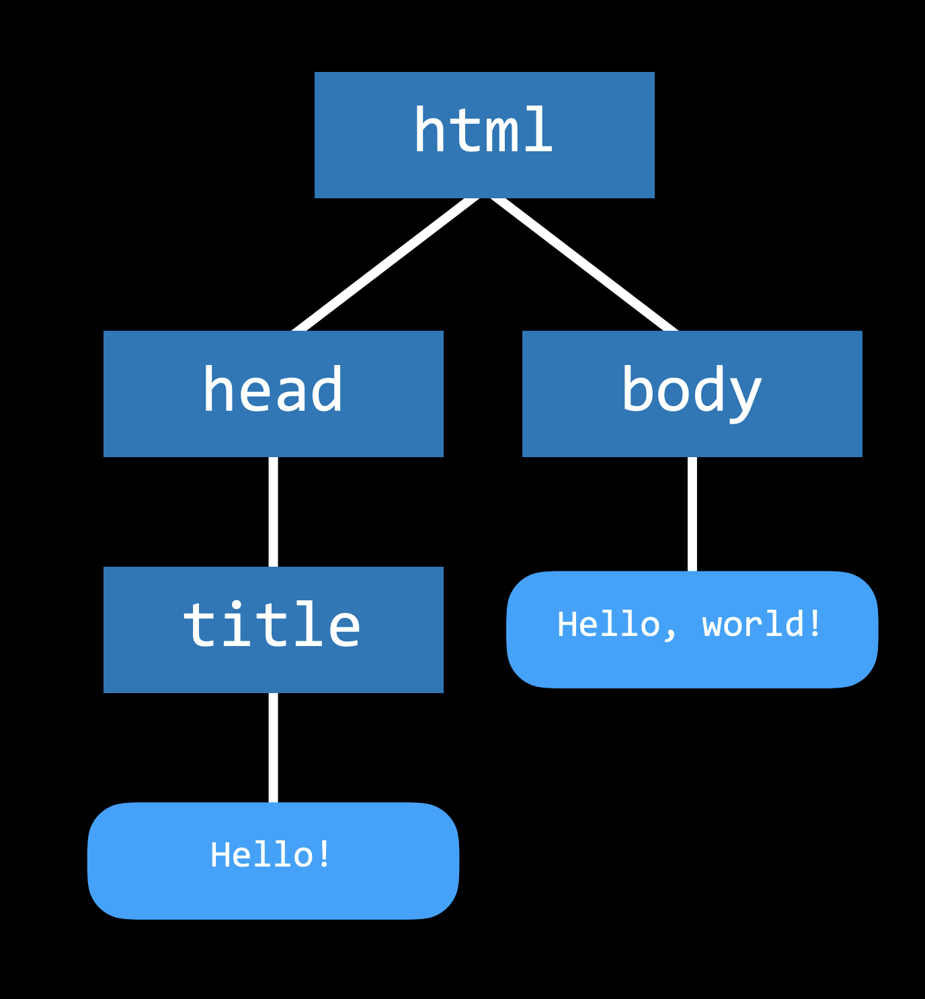

# Lecture 0 HTML and CSS
## HTML Hyper text Markup Language
structure for the web app   
```html
<!DOCTYPE html>
<html lang="en">
    <head>
        <title>Hello!</title>
    </head>
    <body>
        Hello, World!
    </body>
</html>
```

\<!DOCTYPE html> is the doctype declaration ie the language used in the webpage   
the file is organised in Tags <> which are closed with the slash tags </>, inside the tag opening are attributes like 'lang="en"'.   
the head is used for the title and metadata   
the body is the visable part of the page for the user   

Document Object Model (DOM)  


headings - declared with the \<h1>\</h1> h1 biggest h6 smallest   
lists - ordered(numbered) lists \<ol>\</ol>, list item inside the \<li>Item\</li> the items get numbered automatically. unordered(bulletpoints) lists \<ul>\</ul> same in list elements   
image - required attributes \ no closing tag since the picture is one element as it self   
links - use an anchor tag \<a href="https//...">Linktext shown on page\</a>   

Tables 
```html
<body>
    <table>
        <thead>
            <tr>
                <th>Ocean</th>  <!-- one tag for each column heading -->
                <th>Avg Depth</th>
                <th>Max Depth</th>
            </tr>
        </thead>
        <tbody>
            <tr>    <!-- inside the row not column -->
                <td>Pacific Ocean</td> <!-- table data point -->
                <td>4.258 m</td>
                <td>10.911 m</td>
            </tr>
            <tr>    
                <td>Atlantic Ocean</td>
                <td>3.646 m</td>
                <td>8.486 m</td>
            </tr>
        </tbody>
    </table>
</body>

```
forms
```html
<form>
    <input type="text" placeholder="Full Name" name="full_name"> <!-- type makes it a text field, placeholder is whats displayed in the field before typing and name is important for control -->
    <input type="submit"> <!-- submit is a submit button -->
</form>
```
types - password -doesnt show chars; radio - radio button;

## CSS - Cascading style sheets
can be edited inside the html file, the style info automatically affects everything inside a tag, ie putting it in body will affect all tags in body
```html
<body> <!-- inline styling -->
    <h1 style="color: red; text-align: center;">This is a headline</h1>
</body>
```
```html
<head>
    <title>Hi</title>
    <style> <!-- internal styling -->
        h1 {
            color: red; 
            text-align: center;
        }
    </style>
</head>
<body> 
    <h1>This is a headline</h1>
</body>
```
can also be set for specific tags inside a css file
```html
<!-- HTML file -->
<head>
    <title>Hi</title>
    <link rel="stylesheet" href="styles.css">
</head>
```
```css
/* css file 'styles.css' */
h1 {
    color: red; 
    text-align: center;
}
```
changes overrule each other in this order inline(strongest) > internal css > external css. if eg a internal css should override an inline style change !important will do it.

div - a section of the page
```html
<head>
    <title>Hi</title>
    <style>
        h1 {
            background-color: orange;
            width: 500px;
            height: 400px;
            padding: 20px; /* buffer inside between boarder an text*/
            margin: 20px; /* buffer outside between div and window boarder*/
        }
    </style>
</head>
<body>
    <div>
        Hello world
    <div>
```
```css
table {
    border: 1px solid black;
    border-collapse: collapse;
}

td {
    border: 1px solid black;
    padding: 2px;
}

th {
    border: 1px solid black;
    padding: 2px;
}
```
```css
table {
    border: 1px solid black;
    border-collapse: collapse; /* so only one line between cell not aline around every cell */
}

td, th {
    border: 1px solid black;
    padding: 2px; /* buffer inside the cell between line and text */
}
```

giving a tag a *unique* identifier like \<h1 id="my_haeding">
``` html
<head>
    <title>id</title>
    <style>
        #my_heading {
            color: blue;
        }
    </style>
</head>
```
there is way to this not uniquely using classes eg \<h1 class="head">Head1\</h1> , \<h1 class="head">Head2\</h1> , \<h1>Head3\</h1>
```html
<head>
    <title>class</title>
    <style>
        .head {
            color: blue;
        }
    </style>
</head>
```
will only heading 1 and 2  

specificity order: inline(strongest) > id > class > type(eg h1)

### CSS selectors
descendent selector
only affects list items in unordered lists if there is ordered list, too it's items wouldn't be affected
```html
<head>
    <title>Using Selectors</title>
    <style>
        ul li {
            color: blue;
        }
    </style>
</head>
``` 
ul > li would only affects children (not grandchildren)   
a[href="https://example.com] - will only affect the one attribute, so only the example link in the body changed not all links   

### responsive design
change in design depensding on the device

Viewport 
```html
<meta name="viewport" content="width=device-width, initial-scale=1.0">
```
initial scale defines that the receiving device zoom

Media queries
```html
<head>
    <title>Screen Size</title>
    <style>
        @media (min-width: 600px) {
            body {
                background-color: red;
            }
        }

        @media (max-width: 599px) {
            body {
                background-color: blue;
            }
        }
    </style>
</head>
```

Flexbox
```html
<!DOCTYPE html>
<html lang="en">
    <head>
        <title>Screen Size</title>
        <style>
            #container { /* uses flexible design where if the display is small content inside the container gets wrapped around to the next line */
                display: flex; 
                flex-wrap: wrap;
            }

            #container > div {
                background-color: green;
                font-size: 20px;
                margin: 20px;
                padding: 20px;
                width: 200px;
            }
        </style>
    </head>
    <body>
        <div id="container">
            <div>Some text 1!</div>
            <div>Some text 2!</div>
            <div>Some text 3!</div>
            <div>Some text 4!</div>
        </div>
    </body>
</html>
```
Grid
```html
<head>
    <title>My Web Page!</title>
    <meta name="viewport" content="width=device-width, initial-scale=1.0">
    <style>
        .grid {
            background-color: green;
            display: grid;
            padding: 20px;
            grid-column-gap: 20px; /*space between cols*/
            grid-row-gap: 10px;
            grid-template-columns: 200px 200px auto; /*how wide are the individual columns*/
        }

        .grid-item {
            background-color: white;
            font-size: 20px;
            padding: 20px;
            text-align: center;
        }
    </style>
</head>
<body>
    <div class="grid">
        <div class="grid-item">1</div>
        <div class="grid-item">2</div>
        <div class="grid-item">3</div>
    </div>
</body>
```
Bootstarp  

lib for premade css  
needs to be linked a stylesheet in HTML  
bootstrap devides all pages into 12 columns so class="col-3" takes up a fourth of the screens width  
class="col-lg-3 col-sm-6" will take up 3 columns on a lagre screen or 6 on small screen  

Sass - css extension  

removes repetition from css stylings  
file type is .scss  
```scss
$color: red;

ul {
    font-size: 14px;
    color: $color;
}

ol {
    font-size: 18px;
    color: $color;
}
```
sass is not automatically compiled by browser needs to be compiled by hand before (program called sass) into .css file   
in sass nesting is possibple no div > p needed
```scss
div {
    font-size: 18px;

    p {
        color: blue;
    }

    ul {
        color: green;
    }
}
```
