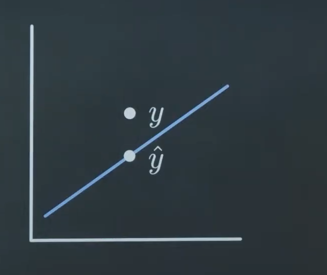
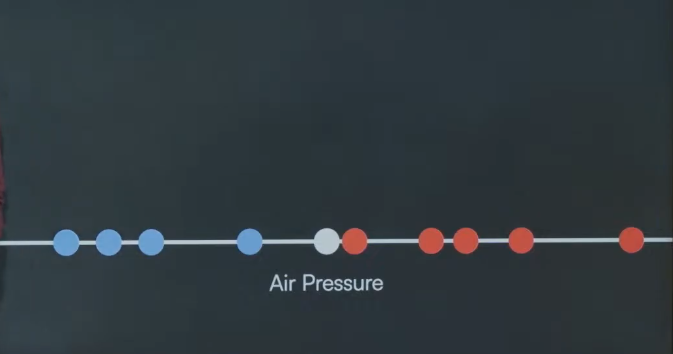
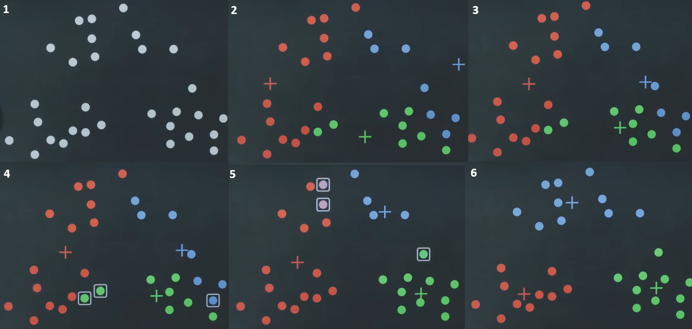

# Lecture 0 Playing
minimax as other ai course
* alpha beta pruning - ignore states in the calculation if there is already a better state 
## Monte Carlo Tree Search
simulate randomly a lot of games.  
compare the results of the simulated games (how often does X win) for two or more different starting changes to determine the 'best' next step  

exploring - with just a few iterations its sensible to explore 'bad' looking options because its likely that the good options are just not found yet   
exploiting - making a choice based on the given data after more iterations, exploiting the knowledge   

in mote carlo tree search during the iterations the combinations are not completely random, there is balance between exploring 'bad' looking options and exploiting the ones that already look promising.  

## reinforcement Learning
learning through remward and punishment  

q learning  
is a n algorith where the agent learns through adding up reward over time. for example in Snake running into a barrier could be -100, getting food +10, moving without incident 0, the agent keeps track of the state the action and the reward and learns though trying to maximise its reward.  

# Lecture 1 Predicting
regression  
predicting a value based on the input variable  
## LinReg

### Loss function  
describes the differences between the measured and the predicted values. if y is measured then ŷ is the predicted value for x on the linear regression. 

from there the absolute error is calculated (absolute value -5 =5 symbol is |) |ŷ -y| , absolute since it doesn't matter if the measured value is underneath or above the prediction only how far it deviates.   
Another meassure is the squared error which accentuates bigger errors since a big number squared equals a way bigger overall error than a small one.  
the mean squared error is the squared error over all datapoints. All three of these measurements are ideally minimized.

## classification
not predicting a number but a a category eg is it going to rain or not.  

Nearest neighbor classification predicts the class of a unknown datapoint by proximity to the closest known point.

NN would predict the unknown (white) Datapoint as a day without rain (red).   
K-NN uses the same overall technique but uses the majority vote from k amount of neighbors around the unknown dataset.  

### Neural Networks
#### Perceptrons

Perceptrons are a type of NN consisting of only one layer that maps input directly to the output. it usually produces a binary output 0 or 1 (unit step function, in modern networks sigmoid functions is more common). neurons are usually labeled as x1-xk weights w1-wk. weights are the translations of the input neurons giving each input a weight, a number, that determines how important the input is for the output. weights are determined during training. so here thr output y would be calculated. b being a preset bias set by the programmer  
w1 x1 + w2 x2 + w3 x3 + w4 x4 + ... + b = y   
usually if the result is positiv the neuron fires, the put is one, and if it's negative it doesn't fire, the output is 0    

weights are assigned randomly and then each time the predicted outcome of the network doesn't match the actual outcome, they're adjusted in correlation with the size of the inputs, so there are two inputs   
input a 3 weight a 1 and input b 7 weight b 1 bias 2,   
the output doesn't match and it should have been a lower out put the new setup could look like this:   
input a 3 weight a 0.7 and input b 7 weight b 0.3 bias 1.8.   

the weights are adjusted, if necessary, for each datapoint once in each epoch (runs over the dataset). the function adjusting the weights/ minimizing the loss function is called gradient descent, if the weights are adjusted on each datapoint it's called Stochastic Gradient Descent on a preset number of datapoints (batch) Batch Gradient Descent and on small batches (smaller than 32 datapoints) Mini-batch Gradient Descent.   

for data not categorisable or dividable linearly hidden layers (referring to all layers except in- and output) are introduced. Hidden layers have their own activation functions ie thresholds the inputs must achieve for it to activate and fire. these layers allow for more complex data to be processed. these layer often use Rectified linear Unit (ReLU) instead of the unit step function, so if node gets the input of < 0 it's still 0 (doesn't fire) if its above 0 the input amount becomes the output, since the output is no longer just 0 or one more complex data problems can be predicted. In this model there are as many outouts as there are categories to predict whose result add up to one eg we have measures from petal and leafs and want to predict which kind of rose these belong to than the result could look like this:   
Output 1: 0.60 &nbsp; Output 2: 0.25 &nbsp; Output 3: 0.15   
meaning that there is a 60% chance of it being the first rose class, 25% chance of being rose class 2, and 15% of it being rose class 3

# Lecture 2 Analysing
ml with labeled data is supervised learning.
## unsupervised learning
convergence - when the model’s loss stops changing significantly with further training
### k-means Clustering
the amount of clusters is preset by the programmer, the model then creates k centerpoints and puts them in the data, in each iteration the points are assigned the datapoints closest to them and then centered within them. like this the centerpoints move around the data till they sit inside a cluster where centering doesn't change the assigned datapoints anymore - convergence

### dimensionally reduction
reducing data for easier visulisation and computing   
by reduction some information is always lost.

### DBSCAN
Density based clustering the algorithm checks if a point is in a densly populated area, which is defined by a certain amount of datapoints in a preset radius. Then it assigns the same cluster to all points that are connected through proximity, if there are no more datapoints near and there are still unassigned datapoints the process begins again with a randomly chosen unassigned datapoint. can be used for anomaly detection

### Apiori Algorithm
support - how often does a certain item appear in the datasets   
firsty the support for each item is calculated, then a threshold is defined for which items are considered to be frequently bought. For the frequent items the support for pairs ist calculated. then again for the frequent pairs they are paired with the frequent items to create triplets, here pairs within the triplets that where eliminated in the last stage are no longer considered.

