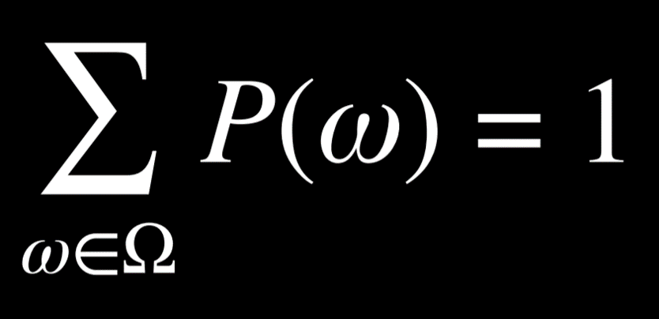
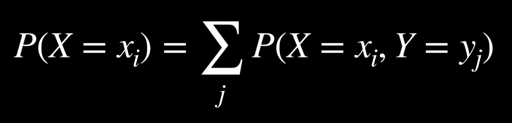
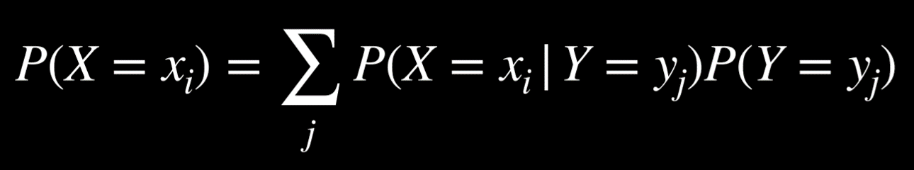
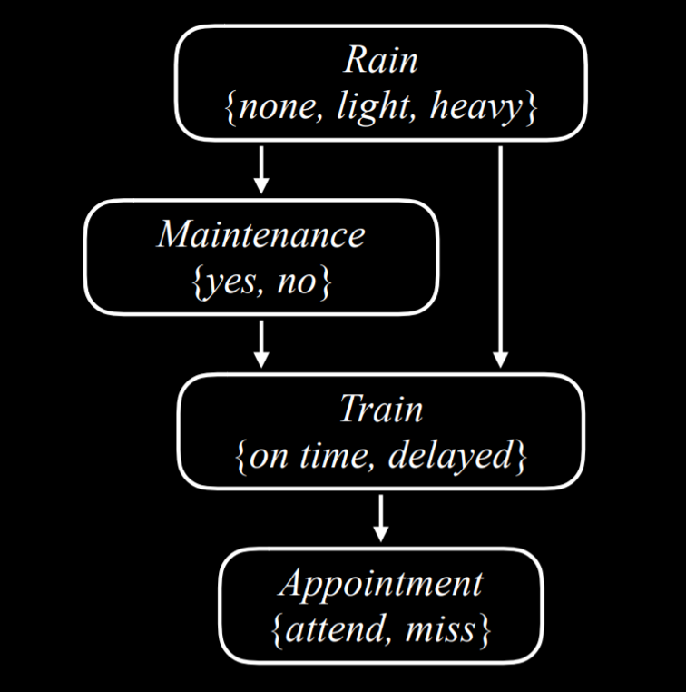

# CS50AI Lecture 0 Search
* agent - entity that perceives environment and acts upon it
* state - configuration of agent, initial state - state where agent begins problem solving
* actions - set possible operations that can be executed per state
* transition model - result function, Result(a,s) returns the state resulting from performing action (a) in state (s), 
  the model is the way to determine what ne state will exits after an action is taken
* state space - the set of all states reachable from initial state by ANY sequence of actions
* graphically the state space is often represented as a graph with node for the spaces and edges for the actions
* goal test - tests if a given state is a goal state
* path cost - numeric cost associated with a given path, so the shortest (cheapest) route is found, might have different 
  cost for different route in the same state space
* optimal solution - solution with the lowest path cost   
<br />
* search problems have initial state, actions , transition model, goal tests and path cost functions   
<br />
* node - Datastructure that keeps track of a 
  * state, 
  * parent( node that generated the current node),
  * an action, that was applied to the parent,
  * a path cost, from the initial state to the current node   
<br />

## search Algorithms
* frontier is a mechanism that manges the nodes, it starts with just the initial state and an empty set for explored Nodes then it repeats   
  1. stop if frontier is empty --> no Solution
  2. remove a Node from the frontier
  3. if the removed node is the goal state return result
  4. expand the Node and add all possible Nodes to the frontier and the current Node to the explored Set
   
* to expand a node means to consider all possible actions
### depth-first search DFS
* uses a Stack as Data structure for the frontier, last in first out
* this approach goes completely through (as deep as possible) one branch of the graph before it considers another because the last Node added will always be next to be explored
* at beat (lucky) this algorithm can be really fast at worst it will exhaust every possibilty before it finds its Mark
* it might not return the optimal path
```python
    # Define the function that removes a node from the frontier and returns it.
    def remove(self):
    	  # Terminate the search if the frontier is empty, because this means that there is no solution.
        if self.empty():
            raise Exception("empty frontier")
        else:
        	  # Save the last item in the list (which is the newest node added)
            node = self.frontier[-1]
            # Save all the items on the list besides the last node (i.e. removing the last node)
            self.frontier = self.frontier[:-1]
            return node
```
### breadth first search BFS
* uses a Queue as Data structure for frontier, first in first out
* goes completely through every level bevor it goes deeper into the initial state
* is more effective the closer initial and goal state lay together
* always returns optimal, might explore every state to get there
  
```python
    # Define the function that removes a node from the frontier and returns it.
    def remove(self):
    	  # Terminate the search if the frontier is empty, because this means that there is no solution.
        if self.empty():
            raise Exception("empty frontier")
        else:
            # Save the oldest item on the list (which was the first one to be added)
            node = self.frontier[0]
            # Save all the items on the list besides the first one (i.e. removing the first node)
            self.frontier = self.frontier[1:]
            return node
```
### greedy best-first search
* expands the Node next, that is closes to the goal determined by heuristic function
* heuristic function - h(n) gives an estimate to what a good solution might be
  * the Manhatten Distance estimates distance by assuming grid lines so it gives an estimate e g of how many steps away a goal is. It is just a guess not an answer
* it makes choices based on the estimate of the heuristic, it always chooses the node with smallest h(n)
* might not return optimal
  
### A* Search
* works similar to greedy best-first but also takes the cost to reach each node(steps) into consideration
* expands the next node that has the lowest g(n) + h(n)\
* g(n) cost to reach current node
* returns optimal if h(n) is admissible (never overestimates) and consistent 
  
### uninformed vs informed search
* uniformed: the search algorithm has no knowledge of the specific problem its solving
  * examples would be DFS or BFS
* informed search uses problem specific knowledge like a general direction to go in
  * e.g greedy best-first search

### adversarial Search
* e g Tic Tac Toe, the objective is not just to win but also not for the opponent to win

#### Minimax Algorithm
* for example in Tic tac toe win states get assigned values, e g O winning as -1, a Tie as 0 and X winning as 1
* in this case X would be the Max player - trying to maximize the Score   
  and O would be the min player - trying to minimize the Score   
  this ensure that a Tie is a preferred option to the opponent winning
* recursive function that goes through the possible decisions and takes the option that has the lowest Value in the end assuming optimal from the opponent 
* there are two functions MIN-Value and MAX- Value that call each other recursively until a terminal state occurs assuming the other function always picks the most optimal option, this gets reevaluated each turn

1. S0 - the board
2. function player(s), returns which players turn it is
3. function actions(s), returns legal moves for State
4. result(s, a) returns the board after the move
5. function Terminal(s), state that terminates game ie winner or tie
6. function utility(s), assigns value to terminal states

#### Alpha-Beta pruning
* optimization for e g MiniMax 
* when looking for lowest Value outcome, if the cost to get to a space is higher than a Space checked before it is pruned and all following options are discarded since it won't be relevant anyway
* alpha beta - based on two values/players/options

#### Depth-limited Minimax
* only goes a certain amount of levels deep into the tree
* evaluation function - estimates the utility at the predetermined depth

# CS50AI Lecture 1 Knowledge
## knowledge based agents
agents that reason on internal representations of knowledge   
* sentence - assertion in a knowledge representation language   
* knowledge base - set of sentences that the ai knows are true   
* inference - process of deriving new sentences based on old ones
## Propositional logic
* uses propositional symbols that represent sentences or facts like P Q R
* logical Connectives ¬ not; ∧ and; ∨ or; → implication; ↔ bi-conditional  
* or includes the possibility of both being right just one would be XOR (⊕)
<br>
### Truth tables   
NOT (¬)   

| P | ¬P |   
|---|----|   
| False | True |   
| True | False |   

AND (∧)

| P | Q | P∧Q |
|---|---|-----|
| False | False | False |
| False | True | False |
| True | False | False |
| True | True | True |

OR (∨)

| P | Q | P∨Q |
|---|---|-----|
| False | False | False |
| False | True | True |
| True | False | True |
| True | True | True |

Implication (→)

| P | Q | P→Q |
|---|---|-----|
| False | False | True |
| False | True | True |
| True | False | False |
| True | True | True | 

if P is true Q must be true for P to imply Q, if P is false the implication cant be falsified so its true.   
Consider a promise:

  Promise: “If I pass the exam (P), then I will celebrate with a party (Q).”

Here are the scenarios:

  If you do pass (P is true) and there is a party (Q is true), the promise is fulfilled.

  If you pass and no party is thrown, the promise is broken (true antecedent, false consequent → implication false).

  If you do not pass (P is false), then whether or not there is a party doesn’t affect the promise because the promise was only about the case of passing. In logic, we call this situation “vacuously true” because the condition that would need to be tested (passing) never actually occurred.

* entailment (⊨)   
α ⊨ β

 alpha entails beta, in every model in which α is true, β is also true

### model checking
knowledge Base : (P ∧ ¬Q) → R
check: KB(knowledge Base) ⊨ α
query (α) - is R True

| P | Q | R | KB |
|---|---|---|---|
| False | False | False | False |
| False | False | True | False |
| False | True | False | False |
| False | True | True | False |
| True | False | False | False |
| True | False | True | True |
| True | True | False | False |
| True | True | True | False |

KB ⊨ α is only true for one instance in this case
### inference rules
#### Modus Ponens 

|  |  |
|--|--|
| α → β  | if alpha entails beta |    
| α      | if alpha is true |
| β      | beta is true can be inferred 

#### And Elimination

|  |  |
|--|--|
| α ∧ β  | if alpha and beta is true |
| α | then just alpha is true | 

#### Double Negation Elimination

|  |  |
|--|--|
| ¬(¬α)  | not alpha is not true |
| α | then alpha is true | 

#### Implication Elimination

|  |  |   |
|--|--| --|
| α → β | if alpha implies beta | if its raining he is inside
| ¬α v β| if not alpha beta is true | either it's not raining or he is inside

#### Bi-conditional Elimination

|  |  |   |
|--|--| --|
| α ↔ β | if alpha Bi-conditionally implies beta | only if it is raining hes is inside
| (α → β) ∧ (β → α) | alpha implies beta and beta implies alpha | if it's raining he's inside; If he's inside it's raining

#### De Morgan's Laws

|  |  |   |
|--|--| --|
| ¬(α ∧ β) | if not alpha and beta | it is not true that a and b passed the test
| ¬α v ¬β | either not alpha or not beta  | a did not pass the test OR b did not pass the test


|  |  |   |
|--|--| --|
| ¬(α v β) | if not alpha or beta | it is not true that a or b passed the test
| ¬α ∧ ¬β | neither alpha nor beta  | a did not pass the test and b did not pass the test

#### Distributive Property

|  |  |
|--|--|
| (α ∧ (β v γ)) | alpha and, beta or gamma are true | 
| (α ∧ β) v (α ∧ γ) | alpha and beta,  or alpha and gamma are true  |

|  |  |
|--|--|
| (α v (β ∧ γ)) | alpha or beta and gamma are true | 
| (α v β) ∧ (α v γ) | alpha or beta and alpha or gamma are true  |

### Theorem Proving 
initial state = knowledge base
actions = inference rules
transition model = updated KB after inference
goal test = checking alpha fro KB ⊨ α query
path cost = number of steps in the proof

clause - a disjunction od literals, propositional symbols connected with or - P v R  
conjunctive normal form (CNF) - logical sentence that is a conjunction (connected by and) of clauses(connected by or)- (P v R) ∧ (D v ¬E) ∧...   
<br>
achieve CNF  
1. Eliminate (change form with inference) bi-conditionals
2. Eliminate implications
3. move ¬ inwards with De Morgan's Laws
4. use distributive Law to distribute v where ever possible

example  
( P v Q) -> R  
¬(P v Q) v R - eliminate implication  
(¬P ∧ ¬Q) v R - De Morgan's Law  
(¬P v R) ∧ (¬Q v R) - distribution --> CNF  

### Inference by resolution (requires CNF)

|  |  |
|--|--|
| P v Q | 
| ¬P v R |
| (Q v R) | resolution|

|  |  |
|--|--|
| P v Q v S | 
| ¬P v R v S|
| (Q v R v S) | resolution|
keeping S double doesn't change the logic of the sentence so it's cancelled 
an empty clause in resolution is always false as in resolving ¬P and P to ()

* to determine KB ⊨ α check KB ∧ ¬α (check by contradiction) if ¬α is contradicted α isd True otherwise there is no entailment(⊨)

KB ∧ ¬α to CNF   
looping over data and simplifying with resolution  
if an empty clause is the result the contradiction is proofed and alpha is true  
example   
KB: (A v B) ∧ (¬B v C) ∧ (¬C)
Query KB ⊨ A (does the knowledge entail A)   
first check the negative so ¬A   
(A v B) ∧ (¬B v C) ∧ (¬C) ∧ (¬A)   
(¬B v C) ∧ (¬C) = (¬B) = (A v B) ∧ (¬B v C) ∧ (¬C) ∧ (¬A) ∧ (¬B)   
(¬B) (A v B) = (A) = (A v B) ∧ (¬B v C) ∧ (¬C) ∧ (¬A) ∧ (¬B) ∧ (A)   
(A) (¬A) = ()

## First-Order Logic
constants - represent objects like person places  
Variables - stand for arbitrary objects like x y z    
Predicate - properties or relationships like loves(x,y), Returns a bool     
quantifiers * Universal(∀) - for all ∀x isHuman(x), every x is human  
            * Existential (∃) - there exists - ∃x Loves(x, John) someone love John     
functions - Map object to another like MotherOf(x), Returns an object   
logical connectives - as in propositional (¬, ∧, ∨, →, ↔)  

# CS50AI Lecture 2 Uncertainty
probability - range 0-1 on a 6 sided die roll 0 would be a 7 so impossible and one die with only three's a three would be certain so a probability of 1 represented mathematically P(ω) is the probability of a worldview.   

ω represents the world we're looking at and Ω represents all the possible worlds. if all ω in Ω are added up the result is 1 since all the possibility are accounted for so one of them must be true. this    



means the probability of the sum from all worlds in all possible worlds equals 1.   

unconditional probability - belief in a proposition in the absence of evidence   
## conditional probability
conditional probability - belief in proposition given certain evidence P(a|b) the probability that a is true given that b is true   
P(a|b) = P(a∧b) / P(b)   
so the probability of a being true given that b is, is the probability of a and b happening dived by the probability for b being true   

P(flight on time) = 0.6  
P(delayed) = 0.3  
P(canceled) = 0.1  
can be summed up as a vector like this   
**P**(Flight) = <0.6, 0.3, 0.1>  

independence - the knowledge that one event does happen has no affect on the probability of the other event happening. So P(a|b) = P(a) since the probability of b happening does not influence the probability of a. More formaley P(a∧b) = P(a)P(b)   

### Bayes' Rule  

multiplying this  P(a|b) = P(a∧b) / P(b) by P(b)    
P(a∧b) = P(b) P(a|b) and also   
P(a∧b) = P(a) P(b|a)   
since both right sides of the equations are equal to P(a∧b) they also must be equal to each other  
 P(a) P(b|a) = P(b) P(a|b)  divide by P(a)
P(b|a) = (P(b) P(a|b)) / P(a) - Bayes' Rule

example 
what's the prob. for rain in the afternoon(a) given it's cloudy in the morning (b);   
known:   
80% of rainy afternoons start /w cloudy mornings; (b|a)   
40% of days have cloudy mornings (b)  
10% of days have rainy afternoons (a)

P(rain|clouds) = P(clouds|rain)P(rain) / P(clouds)   
= (0.8)*(0.1) / 0.4 = 0.2  
if its cloudy in the morning there's a 20% chance of rain in the afternoon   
with this knowing the probability of a visible effect that happens after a unknown cause the prob of the unknown cause given the visible effect can be calculated. eg with knowing how a medical test preforms given that the patient has a disease we can calculate the prob of a patient having the disease given the medical test result.

###  joint probability
probability distribution

| AM | | PM | |
|--- | ---| --- | ---|
|C= cloud | C= ¬cloud | R = rain | R= ¬rain
| 0.4 | 0.6 | 0.1 | 0.9 |


joined prob dis
| | | |
| -- | -- | -- | 
| | R = rain | R= ¬rain |
|C= cloud | 0.08 | 0.32 |
| C= ¬cloud | 0.02 | 0.58 |

P(C|rain) -  what s the probability for clouds given tah its raining?   
P(C|rain) = P(C,rain) / P(rain) # , and ∧ are used interchangeably as AND   
often shown as this cause P(rain) is a constant and alpha here is it's invert   
P(C|rain) = α P(C,rain)
since this is a distribution not rain is omitted in the formula
α<0.08, 0.02> 
normalisation is the process of getting those values add up to one so that they reflect a probability distribution so alpha would be 10
α = 10  == <0.8, 0.2>

### probability Rules
* Negation   
P(¬a) = 1 - P(a)   
since the prob must add up to 1 ,if a and not a are the only two cases,not a is the same as 1 - a   

* inclusion- exclusion    
P(a v b) = P(a) + P(b) - P(a∧b)   
in an example if we want to know the prob of one of two dice rolling a six, just taking the probability of each rolling 6 isn't correct because then the case '2 sixes' is counted double once in each probability   

* Marginalisation   
P(a) = P(a,b) + P(a,¬b)   
meaning in a world of a and b, since there are only two cases for a being true, the probability of a is 'a and b' plus 'a and not b'   

here in a world of x and y the probability of a certain event for x is for all possible event for y the sum over of for the probability of x and y. In the joint world of x and y the probability for a certain x is the joint probability of that certain x and all possible y.  This is a way to calculate an individual prob from a distribution.  

* conditioning  
P(a) = P(a|b)P(b) + P(a|¬b)P(¬b)   
this is the way to calculate P(a) if the joint probability is known using the conditional probabilities. the Probability of a is the Probability that a is true given that b is true times the probability for b plus the probability for a being true given that b is not true times the prob for not b.   
this again also looks more formal and considering all possible events, like this   


## Bayesian Networks
data struct that represents the dependencies among vars  
directed graph, each node is a random variable, arrows indicate  parentship, each Node(X) has a probability distribution **P**(X|Parents(X))  
In this scenario :  
  
the top Node has no parents and is therefor not conditional in this example  

**Rain**  
|none|light|heavy|
|--|--|--|
|0.7|0.2|0.1|

<br>

**Maintenance**
|Rain|yes|no|
|--|--|--|
|none|0.4|0.6|
|light|0.2|0.8|
|heavy|0.1|0.9|
<br>

**Train**
|Rain|Mainta.|on time|delayed|
|--|--|--|--|
none|yes|0.8|0.2
none|no|0.9|0.1
light|yes|0.6|0.4
light|no|0.7|0.3
heavy|yes|0.4|0.6
heavy|no|0.5|0.5

example calc:  
P(light,no,delayed) = P(light) P(no | light) P(delayed | light,no)   
the probability of light rain, no maintenance and a delayed train is the prob for light rain times the prob for no maintenance given that there is light rain times the prob that the train is delayed given that there is light rain and no maintenance. So the unconditional probability is multiplied by the conditional ones.
<br>

**Appointment**
|Train|attend|miss|
|--|--|--|
on time| 0.9|0.1
delayed|0.6|0.4

<br>

### Inference
for the query (X) there are evidence Variables(E) for which exist observed events(e), there are also hidden variables(Y) that are non-query and we want to calculate **P**(X|e) or non-evidence variables. for example if the query (X) is am i going to be on time and we observe that there is light rain and no maintenance, we would ask   
**P**(Appointment|light,no)   
but there would be the hidden variable Train that we haven't observed.   
since conditional probability is proportional to joined probability  
α**P**(Appointment,light,no)   
there are only two possible world either the train is on time or it isn't so adding those up gives us the probability for our query   
α[P(Appointment,light,no,on time) + P(Appointment,light,no,delayed)]   
with the given observation we can calculate the possible worlds for the Train variable this allows to consider the influence of Train solely based on the probability of the events (delayed or on time) without the knowledge of which actually takes place.  
  
X - query  
e - evidence  
y - the range of values the hidden vars can have  
α - normalisation factor

python lib pomergranate  

### Sampling
taking with for example a random number generator choose random option for each variable and build a set of random values to have quick approximate answers. since that is more effective than inferring hundreds of variables.

#### Rejection sampling  
in this methode to answer eg the query what's the possibility for light rain given that the train is on time. all samples where the train wasn't on time are rejected and the frequency of the rain being light in the remaining is used as estimation.

#### likelyhood weighting
here the sampling process is different, the evidence variable (observed) are set and do not get sampled. in the example above all samples would have the train is on time set so that nothing would need to be rejected since it doesn't exist. each sample gets weight by likelihood, likelihood being the probability that the set variable would be 'on time' given the other sampled events (the given value in the table). 

## Markov assumption
the assumption that the current state depends only on a finite fixed number of previous states. for example the predict tomorrows weather you won't look at weather observations ever made but use a fixed set of data.

### Markov Chain
a sequence of random variables where the distribution of each var follows that assumption, often just depending on the last state. Markov models rely on knowing some initial information for example the prob of rain or sun tomorrow given that it's sunny today. with this, the model can infere probability of of rain and sun over next days and the probabilities for certain sets like tomorrow rain day after sun next day rain.

### Hidden Markov Model
a Markov model with hidden states that generate some observed event. For example predicting if people bring umbrellas based on the weather (Sensor Model), so there is no data for the actual event just observations on a related variable.

#### Sensor Markov assumption
the assumption that the evidence variable (umbrellas) depends only on the corresponding state (weather).  

filtering - the calculation of the distribution for the **current** state, given the observations from start until now  
prediction - the calculation of the distribution for a **future** state, given the observations from start until now   
smoothing - the calculation of the distribution for a **past** state, given the observations from start until now    
most likely explanation - the calculation of the most likely **sequence of states**, given the observations from start until now   

# CS50AI Lecture 3 Optimization
## Local Search 
maintains a single node and searches by moving to neighboring node.  
this is usually not used for problems where the shortest path needs to be found but for problems where a space needs  to be found that has the smallest path to several other spaces. for calculation the Manhatten distance can be used.  
with the manhatten distrance a cost can be calculated for different states by summing up the distances, lining those states up in an bar graph called the **state-space landscape**, helps isolate the global maximum or minimum which is detected by the objective function (maximum) or cost function (minimum) 

### Hill climbing
steepest ascent   
algorithm used to find a global maximum, from the current state the neighbor with the higher value is selected and moved to, till a maximum is found. might not actually find the  global max or min but can get stuck at a local one.

stochastic  
randomly uses one of the higher value neighbors not the highest one.  

first choice  
uses the first higher value neighbor, independent of potential even higher values  

random restart  
conducts the algorithm from multiple random starting states.  

local beam search  
keeps track of k highest value neighbors instead of just one. 

## Simulated Annealing
to find the the global min or max reliably, sometimes steps need to be taken to a neighbor with a worse value. In this algorithm the there is a lot a chaos (steps to neighbors with worse values) at the beginning and more order in later steps like the molecule movement in a system at high temperature compared to if the systems is cooled down quickly (Annealing).  

function Simulated-Annealing(problem, max):

    current = initial state of problem
    for t = 1 to max:
        T = Temperature(t)
        neighbor = random neighbor of current
        ΔE = how much better neighbor is than current
        if ΔE > 0:
            current = neighbor
        with probability e^(ΔE/T) set current = neighbor
    return current

traveling Salesman

minimize the total distance traveled to a certain number of cities, each city once ending at the starting city. this is a np complete problem. NP meaning Nondeterministic Polynomial time, and polynominal time being solvable proportional to a polynominal function based on the input n. So tractable in polynominal time are complexities from O(n) to O(n^k) as long as k is constant even if the algorithm isn't feasible in real life. A solution for a NP problem can be verified in polynominal time but finding it takes longer. An NP complete problem can be verified in P time but there is no tractable (quick enough way to be polynominal) way to the solution.

## linear Programming
min or max a cost functions, with constraints on the different variables.  
if machine x1 cost 50/hour needs 5 units of labor/hour and produces 10 units/h.   
machine x2 costs 80/h needs 2 labor/h and produces 12 units/h.   
with the constraints of 20 units of labor and the goal of 90 units produced.