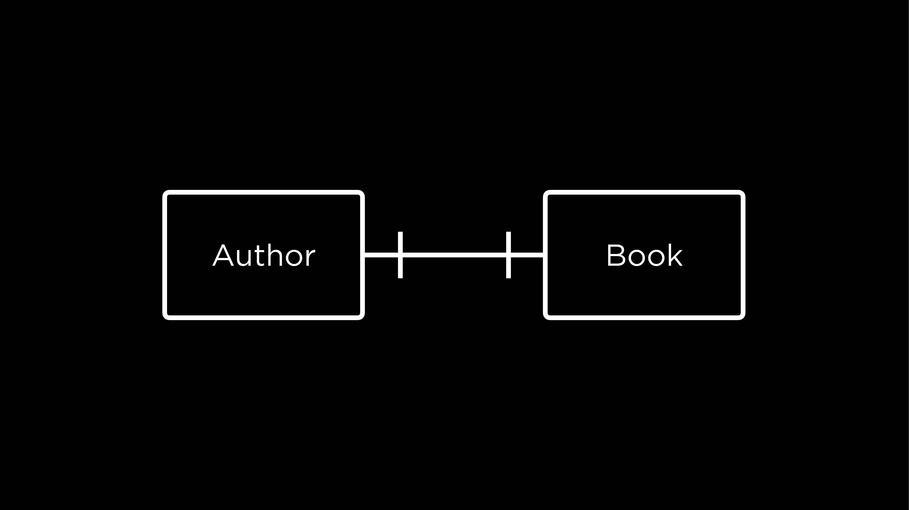

# Lecture 0 Querying
General Order of Keywords <br>
* SELECT – Specifies which columns to retrieve.
* DISTINCT (optional) – Removes duplicate rows from the result.
* FROM – Specifies the table(s) to retrieve data from.
* JOIN – Combines data from multiple tables.
* ON – Defines the condition for the JOIN operation.
* WHERE – Filters rows before grouping.
* GROUP BY – Groups rows that have the same values in specified columns.
* HAVING – Filters grouped rows based on a condition.
* WINDOW (optional) – Defines a window for window functions (used in advanced queries).
* ORDER BY – Sorts the result set by specified columns.
* LIMIT / FETCH – Restricts the number of rows returned.
* OFFSET – Skips a specified number of rows before returning results.

## wildcards with LIKE
% can match any char <br>
_ can match any single char <br>
when searching strings 'LIKE' is Case insensitive '=' is Case sensitive <br>
```sql
SELECT "title" FROM "list" WHERE "title" LIKE '%love%'; -- selects everything that has love in it 
SELECT "title" FROM "list" WHERE "title" LIKE 'love %'; -- selects everything that starts with love
SELECT "title" FROM "list" WHERE "title" LIKE 'p_re'; -- searches for words that start with p have one more letter than re, usefull if spelling is unclear can be used several times in row like p___
```
## Ranges with BETWEEN AND
```sql
SELECT "title", "year" FROM "list" WHERE "year" BETWEEN 2019 AND 2022; -- selects titles from the years 2019 to 2022
SELECT "title", "rating" FROM "list" WHERE "rating" > 4.0; 
```
## ORDER BY
by default Ascending tags ASC DESC <br>
## Aggregate functions
* COUNT AVG MIN MAX SUM
```sql
SELECT ROUND(AVG("rating"),2) AS "Avarage rating" FROM "list"; -- calcs the average rating and rounds it to two decimal points and names the column "Avarage rating"
SELECT COUNT(DISTINCT "publisher") FROM "list";
```
# Lecture 1 Relating
## Relationships

* one to one one author writes one book
* one to many one author writes many books
* many to many many authors write books together

### Crows foot Notation

One to One would look like


## subqueries
```sql
SELECT "name"
FROM "authors"
WHERE "id" = (
    SELECT "author_id"
    FROM "authored"
    WHERE "book_id" = (
        SELECT "id"
        FROM "books"
        WHERE "title" = 'Flights'
    )
);
```
always run form the most inside parenthesis first
* each nesting gets indentation
### IN
```sql
SELECT "title"
FROM "books"
WHERE "id" IN (
    SELECT "book_id"
    FROM "authored"
    WHERE "author_id" = (
        SELECT "id"
        FROM "authors"
        WHERE "name" = 'Fernanda Melchor'
    )
);
```
### JOIN
```sql
SELECT *
FROM "sea_lions"
JOIN "migrations" ON "migrations"."id" = "sea_lions"."id";
```
* standart in sqlite is an inner *JOIN*
    * only rows that have the identifier in both tables are joined
* *LEFT JOIN* - the data in the table first named is prioritised, the the data from the first table is kept even if there are no corresponding values in the right table, only matching rows have entries in all columns
* *RIGHT JOIN* - the data in the table secondly named is prioritised, the the data from the second table is kept even if there are no corresponding values in the left table, only matching rows have entries in all columns
* *FULL JOIN* - all Data is kept only matching rows have entries in all columns
* *NATURAL JOIN* - omits the notation for id columns if there are both named **exactly** the same
```sql
-- Left Join
SELECT *
FROM "sea_lions"
LEFT JOIN "migrations" ON "migrations"."id" = "sea_lions"."id";
-- Natural Join
SELECT *
FROM "sea_lions"
NATURAL JOIN "migrations";
```
## Sets
### INTERSECT
* the intersection of values in two groups eg being both an author an a translator - Authores INTERSECT translators
```sql
SELECT "book_id" FROM "translated"
WHERE "translator_id" = (
    SELECT "id" from "translators"
    WHERE "name" = 'Sophie Hughes'
)
INTERSECT
SELECT "book_id" FROM "translated"
WHERE "translator_id" = (
    SELECT "id" from "translators"
    WHERE "name" = 'Margaret Jull Costa'
);
```

### UNION
* the combination of values of two groups, removes duplicates, eg being either authors or translators, but ensuring each person appears only once in the result - Authores UNION translators
```sql
SELECT 'author' AS "profession", "name" 
FROM "authors"
UNION
SELECT 'translator' AS "profession", "name" 
FROM "translators";
```
### UNION ALL
* the combination of values of two groups, keeps duplicates, eg Listing all occurrences of people being authors or translators, even if they appear in both groups - Authores UNION ALL translators

### EXCEPT
* the exclusion of values from another set in the current set, eg being only an author not a translater - Authores EXCEPT translators
```sql
SELECT "name" FROM "authors"
EXCEPT
SELECT "name" FROM "translators";
```
## GROUP BY
```sql
SELECT "book_id", ROUND(AVG("rating"), 2) AS "average rating"
FROM "ratings"
GROUP BY "book_id"
HAVING "average rating" > 4.0; -- having is where for grouped data
```
grouping data in chunks the apply a function AVG to each chunk, since the data points are no longer addressed individually HAVING is used to address the chunks instead of WHERE

# Lecture 2 Designing
.schema - prints the schema to the cli   
    * .schema 'tablename' - prints only the schema for a table   
.quit - to return to the sqlite prompt

## Normalisation
* put entities in their own table eg people, riders, stations
* establish relations eg many to many       
<br>
1. Normal Form   
Only one Value per Cell  
No duplicate rows, atomic (single) values per column.

2. Normal form   
all columns depend on primary key  
No partial dependencies (columns must depend on full primary key).

3. Normal Form   
non-key columns should only depend on the primary key, not other non-key columns  
No transitive dependencies (columns depend only on the primary key).

4. Normal Form   
independent sets of data should not be stored in the same table  
No multivalued dependencies (separate independent data).

5. Normal form
breaking tables into their smallest form without losing data, seldom used only for very complex dbs with several many to many relations.
No join dependencies (optimizing complex relationships).

## Tables

* Data types don't exist in sqlite the class INTEGER can hold several types of Ints 0-8 byte TEXT up to ?? GB of chars  

* storage classes - NULL INTEGER REAL TEXT BLOB (Binary large object; like images,videos) (the type data is stored as in the end)
* type affinities, in sqlite, INTEGER REAL NUMERIC TEXT BLOB these type affinities are not enforced at all but will be translated into the specified type if possible
* table constraints PRIMARY KEY, FOREIGN KEY
* column constraints 
    * CHECK - logical check like mail regex 
    * DEFAULT - default value if non given
    * NOT NULL - must have data
    * UNIQUE - can occur only once in column
```sql
CREATE TABLE IF NOT EXISTS "name"(
    "Columnname" column_type,
    "id" INTEGER PRIMARY KEY AUTOINCREMENT,
    "something" TEXT NOT NULL CHECK("something" IN ('a','b','c')),
    "some_number" INTEGER CHECK("some_number" != 0),
    "other_id" INTEGER,
    "time" DEFAULT CURRENT_TIMESTAMP,
    FOREIGN KEY ("other_id") REFERENCES "others"("id")
);
```
* DROP TABLE to delete a table + contents
* ALTER TABLE
    * ALTER TABLE "one" RENAME TO "two";
    * ALTER TABLE "two" ADD COLUMN "type" TEXT;
    * ALTER TABLE "two" RENAME COLUMN "" TO "";
    * ALTER TABLE "two" DROP COLUMN "";

# Lecture 3 Writing
## inserting
INSERT INTO - adding data to existing table
```sql
INSERT INTO "tablename" ("column_name1", "column_name2",  "column_name3") 
VALUES 
("val1", "val2", "val3"),
("val4", "val5", 52),
("val7", NULL, "val9");
```
```bash
.import --csv --skip 1 filename.csv tablename # (skips the header)
# will run into trouble if there are different number of columns in the tables id!!
.import --csv filename.csv temp_tablename
```
```sql
INSERT INTO tablename (columns...) 
SELECT (columns...) FROM temp_tablename
```
## deleting
```sql
DELETE FROM "tablename"; -- empties table completely
DELETE FROM "tablename" WHERE title = 'title1'; -- deletes entires with this title
DELETE FROM "tablename" WHERE 'column1' IS NULL; -- IS NULL not = NULL
```
* Deleting data with foreign keys
```sql
-- In the Schema
CREATE TABLE IF NOT EXISTS "name"(
    "id" INTEGER PRIMARY KEY AUTOINCREMENT,
        FOREIGN KEY ("other_id") REFERENCES "others"("id") ON DELETE RESTRICT -- standart
        FOREIGN KEY ("other_id") REFERENCES "others"("id") ON DELETE SET NULL 
        FOREIGN KEY ("other_id") REFERENCES "others"("id") ON DELETE SET DEFAULT
        FOREIGN KEY ("other_id") REFERENCES "others"("id") ON DELETE NO ACTION -- not advised
        FOREIGN KEY ("other_id") REFERENCES "others"("id") ON DELETE CASCADE -- deletes the referenced value too
);
```
## changing data
* String functions
    * UPPER(), LOWER(), [L/R]TRIM(), REPLACE(column, OLD, NEW), ....
* Numeric
    * ABS() [Absolute value], ROUND(), CEIL()/FLOOR() [rounds to nearest INT], RANDOM()
* Date
    * DATE('now'), TIME('now'), DATETIME('now'), STRFTIME(format, timestring)
```sql
UPDATE "tablename" SET "columnname" = (Subquery); -- changes existing entries
UPDATE "tablename" SET "columnname" = TRIM('columnname'); -- removes whitespace on both sides
UPDATE "tablename" SET "columnname" = UPPER('columnname'); -- all caps
```

## TRIGGER
sql statements executed when certain other statements are invoked  
inside the TRIGGER the old entry can be accessed with OLD."columname" and the updated Value with NEW."columname"
```sql
CREATE TRIGGER name
[BEFORE/AFTER] [INSERT/UPDATE/DELETE] ON tablename
FOR EACH ROW
BEGIN
    actual trigger logic;
END;

CREATE TRIGGER test_trigger
BEFORE DELETE ON test_table
FOR EACH ROW
BEGIN
    INSERT INTO Table2 ("col1", "col2")
    VALUES (OLD."col1", "text");
END;
```
# Lecture 4 Viewing
view - virtual table created by query   
views cost less memory than saving the same data in several tables   
CREATE VIEW will alter schema permanently, cant alter stored data through the view
CREATE TEMPORARY VIEW only active till the database connection is closed
```sql
CREATE VIEW viewname AS
SELECT ....;
```
CTE - comman table expression
```sql
WITH name_CTE_1 AS (SELECT...)
SELECT 'column' FROM name_CTE_1 ...;
``` 
# Lecture 5 Optimising 
.timer on - shows elapsed time for each execution   
usually when a query is executed the whole table scanned for the parameters (whole-table-scan)  
search for indexes like primary keys is automatically optimised   

## Indexes
Covering Index, through it queried data can be retrieved from the index as with primary keys, used to save time since not the whole table needs to be searched
```sql
CREATE INDEX indexname
ON tablename (column1,...);
```
```sql
EXPLAIN QUERY PLAN SELECT...
```
shows if for example an index was used